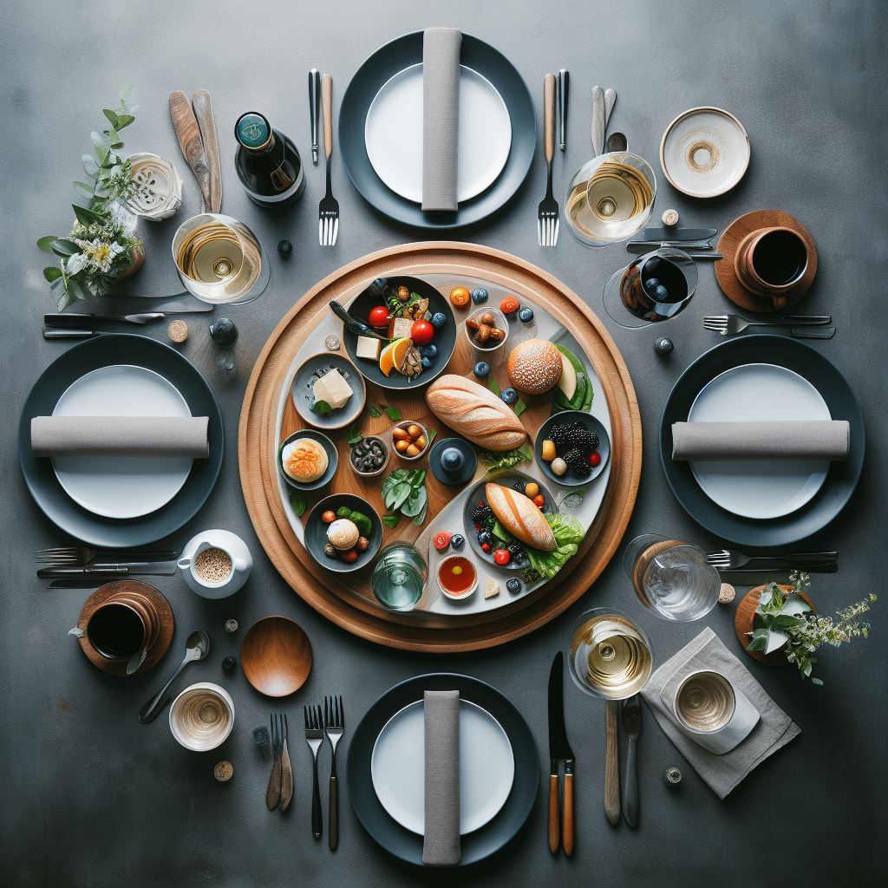
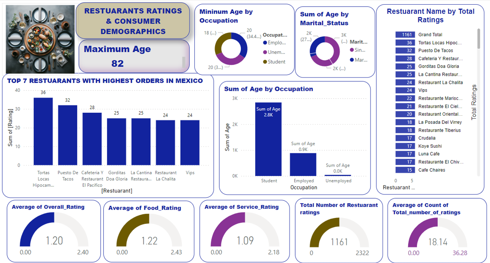

# Restaurant-Rating-Analysis
---

---
## Introduction:
---
This is a restaurant rating report. It is a Capstone Project for my final training with Digitaley Drive Data Analytics Education. This project is to analyze and draw out meaningful insight and answer crucial questions that would aid business entrepreneurs and investors in making more informed data driven decisions.

## Problem Statement:
---
This analysis will showcase the highest rated restaurants, the effect of consumer preferences on ratings and orders.
1.	What can you learn from the highest rated restaurants? Do consumer preferences have an effect on ratings?
2.	What are the consumer demographics? Does this indicate a bias in the data sample?
3.	Are there any demand & supply gaps that you can exploit in the market?
4.	If you were to invest in a restaurant, which characteristics would you be looking for?

## Skills Demonstrated:
---
The following Power Bi Skills were put to use.
•	Dax
•	Get data
•	Power Query
•	Slicers
•	New Measure

## Analysis
---
### Restaurant Rating

I created top 7 restaurants with the highest orders, using the clustered column chart. There i discovered that Tortas Locas Hipocampo has the highest rating of 36, followed Puesto De Tacos as 2nd Rated, Cafeteria Y Restaurant El Pacifico as 3rd, Gorditas Doa Gloria as 4th, La cantina Restaurant as 5th, Restaurant La Chalita as 6th while Vips came 7th. I also discovered that the Ratings are the same as the orders. Why is this so? I ask myself. After some thoughtful moments, i realised that maybe these restaurants use applications to receive orders from consumers and these orders are registered as ratings as well. So, i have concluded that consumer preferences have an effect on ratings. 
Consumer Demographics,maximum age is 82 years,minimum is 18 years for students amd 20 years for most of the employed as well as unemployed.

### Consumer Demographics

Single consumers are more in number that the Married consumers. Atotal number of 128 consumers are single while only 10 are married. so yes there is a bias in the sample, because high orders and ratings are from the singles. this evidence can be seen in the diagram sum of food rating/orders by marital status, 1.3k singles consume more conpared to the 0.1k married consumers.
Yes there is a demand and supply gap in consumer behaviour when it comes to married consumers. This analysis has showcased that married consumers go out less, therefore ordering and rating less. i feel that there should be an online restuarants marketplace where orders can be placed to increase sales and ratings as well from married consummers. 

Apart from Mecican cuisine, other cuisines in demand can be explioted for example the American, Cafeteria anf Family cuisines if properly invested into can become a mojor in Mexico too.

