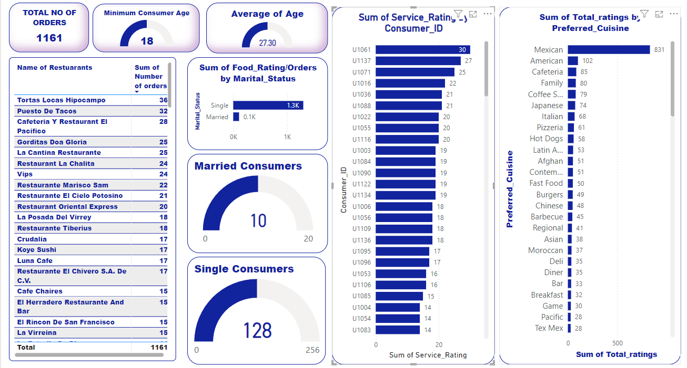

# Restaurant-Rating-Analysis
---

---
## Introduction:
---
This is a restaurant rating report. It is a Capstone Project for my final training with Digitaley Drive Data Analytics Education. This project is to analyze and draw out meaningful insight and answer crucial questions that would aid business entrepreneurs and investors in making more informed data driven decisions.

## Problem Statement:
---
This analysis will showcase the highest rated restaurants, the effect of consumer preferences on ratings and orders.
1.	What can you learn from the highest rated restaurants? Do consumer preferences have an effect on ratings?
2.	What are the consumer demographics? Does this indicate a bias in the data sample?
3.	Are there any demand & supply gaps that you can exploit in the market?
4.	If you were to invest in a restaurant, which characteristics would you be looking for?

## Skills Demonstrated:
---
The following Power Bi Skills were put to use.
•	Dax
•	Get data
•	Power Query
•	Slicers
•	New Measure

## Analysis
---
### Restaurant Rating

I created top 7 restaurants with the highest orders. There i discovered that Tortas Locas Hipocampo has the highest ating of 36, followed Puesto De Tacos as 2nd Rated, Cafeteria Y Restaurant El Pacifico as 3rd, Gorditas Doa Gloria as 4th, La cantina Restaurant as 5th, Restaurant La Chalita as 6th while Vips came 7th. i also discovered that the Ratings are the same as the orders. Why is this so? Iask myself. After some thoughtful moments, i realised that maybe these restaurants use applications to receive orders from consumers and these orders are registered as ratings as well. So, i have concluded that consumer preferences have an effect on ratings.

